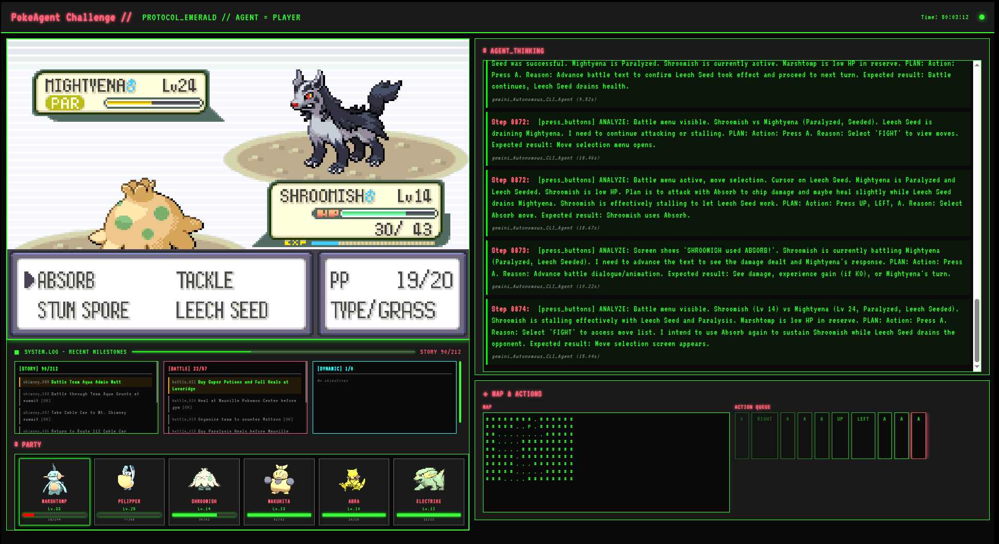
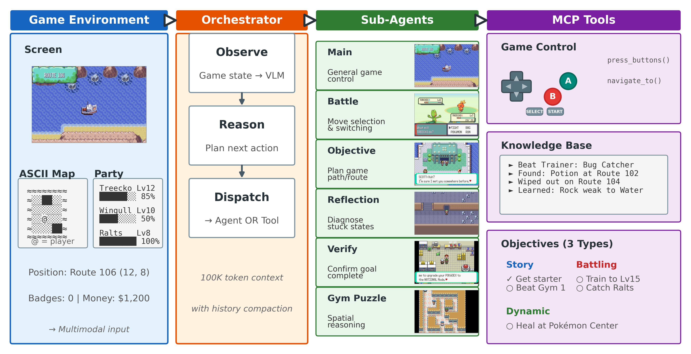

# PokéAgent Challenge: RPG Speedrunning Agent in Pokémon Emerald



## Custom PokeAgent Harness



## Table of Contents

- [Overview](#overview)
- [Architecture](#architecture)
- [Features](#features)
- [Directory Structure](#directory-structure)
- [Requirements](#requirements)
- [Installation](#installation)
  - [1. Clone the Repository](#1-clone-the-repository)
  - [2. Environment (uv or Conda)](#2-environment-uv-or-conda)
  - [3. mGBA System Library](#3-mgba-system-library)
  - [4. Python Dependencies](#4-python-dependencies)
  - [5. Game ROM](#5-game-rom)
- [VLM Backend Setup (run.py)](#vlm-backend-setup-runpy)
- [CLI Agent Backend Setup (run_cli.py)](#cli-agent-backend-setup-run_clipy)
- [Running the Agent](#running-the-agent)
- [Command Line Options](#command-line-options)
- [Customizing Agent Behavior](#customizing-agent-behavior-prompt-editing-guide)
- [Advanced Configuration](#advanced-configuration)
- [Troubleshooting](#troubleshooting)
- [Submission Instructions](#submission-instructions)
- [Citation](#citation)
- [License](#license)

## Overview

This project implements an AI agent capable of playing Pokémon Emerald on a Game Boy Advance emulator. `PokeAgent` uses a vision-language model (VLM) to analyze game frames, understand the current game state, and make intelligent decisions to progress through the game via a series of MCP tools that we expose. `PokeAgent` is designed to be easily customizable for different VLMs and agent behaviors.

## Architecture

The system uses a **headless server**: the game and emulator run in a server process; agents and UIs run as clients. The server exposes HTTP REST and MCP endpoints; clients poll for state and submit actions.

For module-level detail, see the README in each area:

- **[server/README.md](server/README.md)** — Game server, frame streaming, MCP proxy, ports and endpoints.
- **[agents/README.md](agents/README.md)** — PokeAgent, prompts, objectives, prompt optimization, local subagents.
- **[pokemon_env/README.md](pokemon_env/README.md)** — Emulator, memory reader, Porymap map data.
- **[utils/README.md](utils/README.md)** — Mapping, persistence, VLM backends, metrics.

Maintainer architecture notes: **[System-Design/README.md](System-Design/README.md)** (dynamic map overlay, integration points).

## Features

- **Multiple VLM backends**: OpenAI, OpenRouter, Google Gemini, Anthropic, (via `utils/vlm_backends.py`)
- **Vision-based perception**: VLMs analyze game frames and state
- **Agent scaffolds**: PokeAgent (optional trajectory-based prompt optimization via `--enable-prompt-optimization`; separate from the in-agent `subagent_reflect` tool), vision-only
- **PokeAgent local subagents**: `subagent_reflect`, `subagent_verify`, `subagent_gym_puzzle`, and `subagent_summarize` are one-step local VLM calls; `subagent_battler` is a delegated battle loop that consumes real global steps but returns only a compacted battle summary to the orchestrator; `subagent_plan_objectives` is a delegated planning loop that can view, create, modify, and delete objectives via `replan_objectives`. Logged interaction names remain readable (`Subagent_Reflect`, `Subagent_Verify`, `Subagent_Summarize`, `Gym_Puzzle_Analysis`, `Subagent_Battler`, `Subagent_Plan_Objectives`). Trajectory logging is **primary** at `.pokeagent_cache/{run_id}/trajectory_history.jsonl` (`RunDataManager.log_trajectory`); a copy may sync to `run_data/{run_id}/trajectory_history.jsonl`.
- **MCP support**: External CLI agents (Claude Code/Codex CLI/Gemini CLI) interact with the game via `pokemon_mcp_server.py`. Containerization limits non-tool HTTP to the game server. The HTTP game server does **not** implement local subagents such as `subagent_reflect`; CLI agents use a reduced MCP surface (see `server/cli/pokemon_mcp_server.py`).
- **Checkpoints & backups**: Save/resume runs; backups in `backups/`; analysis data in `run_data/`. Backups restore **disk** state under `.pokeagent_cache/` (objectives, long-term memory, checkpoint, trajectories file if present, etc.), not the agent’s in-memory short-term conversation window—see [utils/README.md](utils/README.md) (`data_persistence`).
- **Metrics & logging**: Per-step and cumulative tokens, cost, actions, as well as run initialization settings are found in .pokeagent_cache/{run_id}/cumulative_metrics.json; LLM logs (llm_logs/) and other session logs are also tracked, though cumulative_metrics is the single source of truth. One-step local subagents (reflect, verify, summarize, gym puzzle) record a synthetic `tool_calls` row on their step so the interaction name is visible next to token usage (they do not invoke MCP tools).
- **Map system**: Porymap integration, NPC display, movement preview, portal tracking. For allowlisted maps (e.g. Mauville Gym), a **live metatile overlay** reconciles static decomp grids with WRAM when scripts change tiles at runtime; see [System-Design/README.md](System-Design/README.md).
- **Web interface**: Real-time stream at `http://localhost:8000/stream` by default. The port can be manually specified via the --port flag to both run.py and run_cli.py
- **Video recording**: Optional MP4 recording of gameplay saved to `run_data/{run_id}/end_state/videos/`
- **Customizable prompts**: Edit prompt assets under `agents/prompts/` to directly steer agent behavior.

## Directory Structure

```
pokeagent-speedrun/
├── README.md
├── pyproject.toml            # Project config and dependencies (uv/pip)
├── uv.lock                   # Locked dependency versions (uv sync uses this)
├── requirements.txt          # Pip fallback (frozen from env)
├── run.py                    # Multiprocess entry: starts server + in-repo agent client
├── run_cli.py                # Entry for external CLI agents (MCP); spawns server + MCP proxy
├── server/
│   ├── app.py                # FastAPI game server (emulator, /state, /action, /mcp/*, etc.)
│   ├── agent_thinking.txt    # Runtime file (gitignored); server writes latest thinking for UI
│   ├── frame_server.py       # Frame streaming
│   ├── stream.html           # Web UI for streaming
│   └── cli/
│       └── pokemon_mcp_server.py   # MCP proxy: stdio ↔ HTTP to game server
├── agents/
│   ├── __init__.py           # Package exports (PokeAgent, VisionOnlyAgent)
│   ├── PokeAgent.py          # Main benchmark agent
│   ├── vision_only_agent.py
│   ├── subagents/            # reflect, verify, summarize, battler, planner, gym_puzzle; utils/ = registry, runtime, context, trajectory_window, puzzle_solver
│   ├── utils/                # prompt_optimizer, etc.
│   ├── objectives/           # Direct objectives, types, categorization
│   └── prompts/              # Canonical prompt assets and path helpers
├── utils/
│   ├── mapping/              # ascii_map_loader, dynamic_map_overlay, map_formatter, map_stitcher,
│   │                          # map_stitcher_singleton, pathfinding, pokeemerald_parser,
│   │                          # porymap_json_builder, porymap_state
│   ├── data_persistence/     # backup_manager, run_data_manager, llm_logger
│   ├── agent_infrastructure/ # cli_agent_backends, vlm_backends
│   ├── metric_tracking/      # session readers (claude, gemini, codex), server_metrics
│   ├── state_formatter.py    # Facade; re-exports from utils.mapping.porymap_state
│   ├── knowledge_base.py     # Shared by agents and server
│   ├── anticheat.py, error_handler.py, json_utils.py, ocr_dialogue.py
│   └── ...
├── pokemon_env/
│   ├── emulator.py           # EmeraldEmulator (mGBA, input, frame advance)
│   ├── memory_reader.py      # PokemonEmeraldReader (DO NOT MODIFY for submissions)
│   ├── emerald_utils.py, enums.py, types.py, utils.py
│   ├── porymap_paths.py      # Centralized path resolution for porymap data
│   ├── porymap/              # Pokeemerald decompilation data (data/maps, data/tilesets)
│   └── ...
├── tests/
│   ├── run_tests.py, states/, ground_truth/, test_*.py
│   └── ...
├── Emerald-GBAdvance/        # rom.gba (not included), *.state
├── .pokeagent_cache/        # Runtime cache per run (checkpoints, metrics, maps)
├── backups/                 # Backup archives
├── run_data/                # Per-run analysis data
└── llm_logs/                # LLM interaction logs (auto-generated)
```

## Requirements

- Python 3.10–3.11
- Pokémon Emerald ROM (not included; obtain legally)
- An API key for access to of the supported VLM backends (see VLM Backend Setup)
- mGBA system library for Python bindings

## Installation

### 1. Clone the Repository

```bash
git clone https://github.com/sethkarten/pokeagent-speedrun
cd pokeagent-speedrun
```

### 2. Environment (uv or Conda)

**Option A – uv (recommended):**

[uv](https://docs.astral.sh/uv/) uses `pyproject.toml` and `uv.lock` for reproducible installs.

```bash
# Install uv (if needed)
curl -LsSf https://astral.sh/uv/install.sh | sh

# Create .venv and install dependencies from uv.lock
uv sync

# Activate the environment (prompt will show (pokeagent-speedrun))
source .venv/bin/activate
```

To run without activating: `uv run python run.py ...` (uv uses the project venv automatically). For dev tools (pytest, ruff, mypy): `uv sync --group dev`.

**Option B – Conda:**

Create a conda env (e.g. `conda create -n pokeagent python=3.10`), then install a compatible `libffi` in the env (e.g. `conda install libffi`) so the mGBA Python bindings work, and install Python deps: `pip install -r requirements.txt`.

### 3. mGBA System Library

Required for the mGBA Python bindings. Example (Ubuntu 20.04):

```bash
wget https://github.com/mgba-emu/mgba/releases/download/0.10.5/mGBA-0.10.5-ubuntu64-focal.tar.xz
tar -xf mGBA-0.10.5-ubuntu64-focal.tar.xz
sudo dpkg -i mGBA-0.10.5-ubuntu64-focal/libmgba.deb
```

macOS (x86_64): `brew install mgba`

### 4. Python Dependencies

- **uv:** Already done in step 2 (`uv sync`). Re-run `uv sync` if `pyproject.toml` or `uv.lock` change.
- **pip:** `pip install -r requirements.txt` (e.g. inside your conda env).

### 5. Game ROM

Place your Pokémon Emerald ROM at `Emerald-GBAdvance/rom.gba`. US English SHA-1: `f3ae088181bf583e55daf962a92bb46f4f1d07b7`.

## VLM Backend Setup (run.py)

Set the required env var(s) for your backend, then run with the template below. You can vary flags (e.g. `--load-state`, `--headless`, `--record`) as needed.

**Default template:**

```bash
python run.py --backend {backend} --model-name {name} --port 8000 --agent-auto --scaffold pokeagent --direct-objectives categorized_full_game --direct-objectives-start 0 --direct-objectives-battling-start 0
```


| Backend       | Env var(s)                                                | Example (replace `{backend}` and `{name}` in template)                      |
| ------------- | --------------------------------------------------------- | --------------------------------------------------------------------------- |
| OpenAI        | `OPENAI_API_KEY`                                          | `--backend openai --model-name gpt-5`                                       |
| Anthropic     | `ANTHROPIC_API_KEY`                                       | `--backend anthropic --model-name claude-sonnet-4.5`                        |
| OpenRouter    | `OPENROUTER_API_KEY`                                      | `--backend openrouter --model-name anthropic/claude-4.5-sonnet`             |
| Google Gemini | `GEMINI_API_KEY` or `GOOGLE_API_KEY`                      | `--backend gemini --model-name gemini-3-flash-preview`                      |
| Vertex        | Google Cloud auth (e.g. `GOOGLE_APPLICATION_CREDENTIALS`) | `--backend vertex --model-name gemini-3-flash-preview`                      |
| Auto          | Any of the above                                          | `--backend auto --model-name <model-id>` (backend inferred from model name) |


## CLI Agent Backend Setup (run_cli.py)

External CLI agents (Claude Code, Codex, Gemini CLI) connect via MCP. Set the required env / auth, then use the template below. First run with a given backend image: add `--build` so the container is built with your UID/GID.

**Default template:**

```bash
python run_cli.py --backend {backend} --api-gateway openrouter --directive agents/prompts/cli-agent-directives/pokemon_directive.md --port 8000
```


| Backend | Env / Auth                                                                                                             | Example                                                                     |
| ------- | ---------------------------------------------------------------------------------------------------------------------- | --------------------------------------------------------------------------- |
| Claude  | `claude auth login` (OAuth), or `ANTHROPIC_API_KEY`; for OpenRouter: `OPENROUTER_API_KEY` + `--api-gateway openrouter` | `--backend claude`; OpenRouter: `--backend claude --api-gateway openrouter` |
| Gemini  | `GEMINI_API_KEY`                                                                                                       | `--backend gemini`                                                          |
| Codex   | `codex login` or `OPENAI_API_KEY`; for OpenRouter: `OPENROUTER_API_KEY` + `--api-gateway openrouter`                   | `--backend codex`; OpenRouter: `--backend codex --api-gateway openrouter`   |


CLI agents run in Docker for isolation. Use `--build` on first run (e.g. `python run_cli.py --backend claude --build --directive agents/prompts/cli-agent-directives/pokemon_directive.md`), then omit `--build` for later runs.

## Running the Agent

**run.py** (in-repo agent): Starts the game server, then runs the selected agent client. Use the [VLM Backend Setup](#vlm-backend-setup-runpy) template and swap in your `--backend` and `--model-name`. Examples of common variants:

```bash
# Load a specific state or resume from checkpoint
python run.py --backend gemini --model-name gemini-2.5-flash --load-state Emerald-GBAdvance/splits/01_tutorial/01_tutorial.state --port 8000 --agent-auto --scaffold pokeagent --direct-objectives categorized_full_game --direct-objectives-start 0 --direct-objectives-battling-start 0
python run.py --backend gemini --model-name gemini-2.5-flash --load-checkpoint --port 8000 --agent-auto --scaffold pokeagent --direct-objectives categorized_full_game --direct-objectives-start 0 --direct-objectives-battling-start 0

# Headless with recording
python run.py --backend gemini --model-name gemini-2.5-flash --port 8000 --agent-auto --scaffold pokeagent --headless --record --direct-objectives categorized_full_game --direct-objectives-start 0 --direct-objectives-battling-start 0
```

**run_cli.py** (external CLI agents via MCP): Starts the game server and MCP proxy; the CLI agent in the container talks to the game via MCP tools. Use the [CLI Agent Backend Setup](#cli-agent-backend-setup-run_clipy) template; set the required env/auth for your backend and add `--build` on first run.

**Debug controls (with display):** M = state overlay, Shift+M = map, S = screenshot, Tab = cycle mode, Space = one agent step, 1/2 = save/load state, arrows/WASD = move, Z/X = A/B.

**Web UI:** `http://localhost:8000/stream` (or your `--port`).

## Agent Scaffolds

Choose behavior with `--scaffold` (default: `pokeagent`).


| Scaffold         | Description                                                                               |
| ---------------- | ----------------------------------------------------------------------------------------- |
| `pokeagent`      | Default. Main benchmark agent with direct objectives, knowledge, and prompt optimization. |
| `autonomous_cli` | Legacy alias for `pokeagent`.                                                             |
| `vision_only`    | Vision-only agent (no map info, no pathfinding, button sequences).                        |


Example:

```bash
python run.py --scaffold pokeagent --agent-auto
```

## Command Line Options

### run.py


| Flag                                     | Description                                                                                                                                              |
| ---------------------------------------- | -------------------------------------------------------------------------------------------------------------------------------------------------------- |
| `--rom PATH`                             | Path to the ROM file (default: `Emerald-GBAdvance/rom.gba`).                                                                                             |
| `--port INT`                             | Port for the game server and web interface (default: 8000). Frame server and MCP server are accessed through at ports at a +1 and +2 offset respectively |
| `--load-state PATH`                      | Load a saved state file on startup.                                                                                                                      |
| `--load-checkpoint`                      | Load from checkpoint files in the run cache.                                                                                                             |
| `--backup-state PATH`                    | Load from a backup zip; extracts to cache and loads checkpoint, metrics, and persistent knowledge (preferred for resuming a run).                        |
| `--backend NAME`                         | VLM backend: `openai`, `gemini`, `openrouter`, `anthropic`, or `auto` (default: `gemini`).                                                               |
| `--model-name TEXT`                      | Model name for the backend (default: `gemini-2.5-flash`).                                                                                                |
| `--scaffold NAME`                        | Agent scaffold: `pokeagent`, `autonomous_cli`, or `vision_only` (default: `pokeagent`).                                                                  |
| `--headless`                             | Run without the pygame display.                                                                                                                          |
| `--agent-auto`                           | Run the agent in automatic mode (no manual stepping).                                                                                                    |
| `--manual`                               | Start in manual mode instead of agent mode.                                                                                                              |
| `--record`                               | Record video of gameplay to `run_data/{run_id}/end_state/videos/`.                                                                                       |
| `--no-ocr`                               | Disable OCR dialogue detection (default: on).                                                                                                            |
| `--direct-objectives NAME`               | Load a direct objective sequence (e.g. `categorized_full_game`, `autonomous_objective_creation`).                                                        |
| `--direct-objectives-start INT`          | Start index for story objectives (default: 0).                                                                                                           |
| `--direct-objectives-battling-start INT` | Start index for battling objectives in categorized mode (default: 0).                                                                                    |
| `--clear-knowledge-base`                 | Clear `knowledge_base.json` before starting.                                                                                                             |
| `--run-name TEXT`                        | Optional suffix for the run directory name.                                                                                                              |
| `--enable-prompt-optimization`           | Enable reflective prompt optimization from trajectory analysis.                                                                                          |
| `--optimization-frequency INT`           | Steps between prompt optimization runs (default: 10).                                                                                                    |
| `--allow-walkthrough`                    | Enable `get_walkthrough` tool (vision_only scaffold).                                                                                                    |
| `--allow-slam`                           | Enable SLAM / map building (vision_only scaffold).                                                                                                       |


### run_cli.py


| Flag                            | Description                                                                                                                                                             |
| ------------------------------- | ----------------------------------------------------------------------------------------------------------------------------------------------------------------------- |
| `--backend NAME`                | CLI agent backend: `claude`, `gemini`, or `codex` (default: `claude`).                                                                                                  |
| `--api-gateway NAME`            | Auth: `login` (OAuth/subscription, default) or `openrouter` (uses `OPENROUTER_API_KEY`).                                                                                |
| `--login`                       | Run backend-specific auth login before starting (e.g. `claude auth login`).                                                                                             |
| `--directive PATH`              | Path to system prompt/directive file for the CLI agent (default: repo CLI directive).                                                                                   |
| `--port INT`                    | Port for the game server (default: 8000).                                                                                                                               |
| `--load-state PATH`             | Load a saved state file on startup.                                                                                                                                     |
| `--load-checkpoint`             | Load from checkpoint files in the run cache.                                                                                                                            |
| `--backup-state PATH`           | Load from a backup zip; extracts to cache and enables checkpoint load.                                                                                                  |
| `--termination-condition NAME`  | Condition type to stop the run (default: `gym_badge_count`).                                                                                                            |
| `--termination-threshold INT`   | Threshold for termination (e.g. 1 = first badge; default: 1).                                                                                                           |
| `--poll-interval INT`           | Seconds between termination checks (default: 10).                                                                                                                       |
| `--graceful-timeout INT`        | Seconds to wait for graceful shutdown before force kill (default: 30).                                                                                                  |
| `--record`                      | Record video of gameplay.                                                                                                                                               |
| `--no-ocr`                      | Disable OCR dialogue detection (default: on).                                                                                                                           |
| `--direct-objectives NAME`      | Load a specific direct objective sequence.                                                                                                                              |
| `--direct-objectives-start INT` | Start index for direct objectives (default: 0).                                                                                                                         |
| `--run-name TEXT`               | Optional name for the run directory.                                                                                                                                    |
| `--build`                       | Build the container image before running (recommended so files are owned by your user).                                                                                 |
| `--mcp-sse-port INT`            | Port for MCP SSE server (default: game port + 2).                                                                                                                       |
| `--agent-thinking-effort LEVEL` | Reasoning/thinking effort for CLI agent: `low`, `medium`, or `high` (Claude: `--thinking-budget`; Codex: `-c model_reasoning_effort`; Gemini: `modelConfigs` override). |


## Customizing Agent Behavior (Prompt Editing Guide)

- **Prompt files**: `agents/prompts/` holds `pokeagent-directives/` and `cli-agent-directives/`; paths are repo-root-relative.
- **Main benchmark agent**: `agents/PokeAgent.py`.
- **Vision-only variant**: `agents/vision_only_agent.py`.

Edit the prompts in those files and restart the agent. Use `--debug-state` for detailed state in logs. For Nuzlocke-style behavior, change the system prompt and action/memory logic accordingly.

## Advanced Configuration

- **Environment**: `OPENAI_API_KEY`, `OPENROUTER_API_KEY`, `GEMINI_API_KEY`, `GOOGLE_API_KEY`; optional `PYTHONPATH` for development.
- **Persistence**: Checkpoints and run data are under `.pokeagent_cache/{run_id}/` and `run_data/{run_id}/`. Backups of `.pokeagent_cache/{run_id}/` are created on objective or milestone completion; milestone ordering comes from the canonical `MILESTONE_PHASES`/`ORDERED_PROGRESS_MILESTONES` in `pokemon_env/emulator.py`. See [utils/README.md](utils/README.md) for layout.
- **Metrics**: `cumulative_metrics.json` (in cache) and LLM logs; see [utils/README.md](utils/README.md).

## Troubleshooting

- **Module not found**: Ensure deps are installed (`uv sync` or `pip install -r requirements.txt`) and `PYTHONPATH` includes the repo root if needed.
- **Web UI**: Ensure the server is running and the port (default 8000) is free; open `http://localhost:8000/stream`. You may need to forward the port to your local machine if you are connected via ssh

## Fair Use and Modification Guidelines

**Allowed:** Changing agent behavior (prompts, planning, memory), adding or changing VLM backends in `utils/agent_infrastructure/vlm_backends.py`, improving logging, tests, docs, performance, UI, and utilities.

**Not allowed (for competitive submissions):** Modifying `pokemon_env/memory_reader.py` or memory-reading logic, changing how game state is extracted, altering emulator core or anti-cheat, or manipulating game memory outside normal button input.

## Submission Instructions

Submission requirements, how to submit, evaluation criteria, and tips for success are coming soon. All submission infrastructure will live at **[pokeagentchallenge.com](https://pokeagentchallenge.com)**.

## Citation

If you use this codebase in your research, please cite:

```bibtex
@misc{karten2026pokeagentchallengecompetitivelongcontext,
      title={The PokeAgent Challenge: Competitive and Long-Context Learning at Scale}, 
      author={Seth Karten and Jake Grigsby and Tersoo Upaa Jr and Junik Bae and Seonghun Hong and Hyunyoung Jeong and Jaeyoon Jung and Kun Kerdthaisong and Gyungbo Kim and Hyeokgi Kim and Yujin Kim and Eunju Kwon and Dongyu Liu and Patrick Mariglia and Sangyeon Park and Benedikt Schink and Xianwei Shi and Anthony Sistilli and Joseph Twin and Arian Urdu and Matin Urdu and Qiao Wang and Ling Wu and Wenli Zhang and Kunsheng Zhou and Stephanie Milani and Kiran Vodrahalli and Amy Zhang and Fei Fang and Yuke Zhu and Chi Jin},
      year={2026},
      eprint={2603.15563},
      archivePrefix={arXiv},
      primaryClass={cs.LG},
      url={https://arxiv.org/abs/2603.15563}, 
}
```

## License

This project is licensed under the MIT License - see the [LICENSE](LICENSE) file for details. Make sure to comply with the terms of service of any VLM APIs you use.