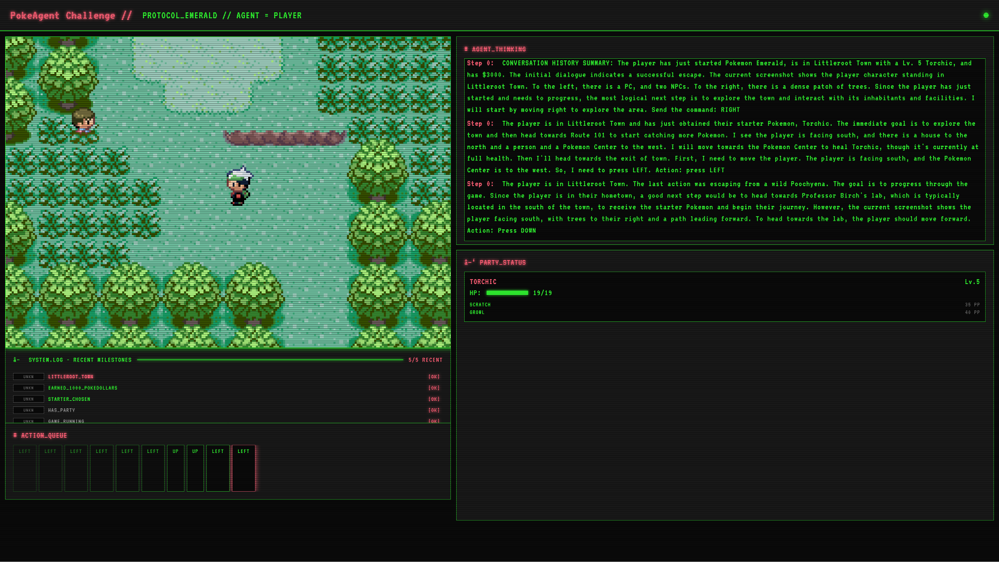

# PokéAgent Challenge: RPG Speedrunning Agent in Pokémon Emerald



An AI agent that plays Pokémon Emerald using vision-language models to perceive the game environment, plan actions, and execute gameplay strategies. This is a **starter kit** designed to be easily customizable for different VLMs and agent behaviors.

## Table of Contents

- [Overview](#overview)
- [Features](#features)
- [Directory Structure](#directory-structure)
- [Requirements](#requirements)
- [Installation](#installation)
  - [1. Clone the Repository](#1-clone-the-repository)
  - [2. Create Conda Environment (Recommended)](#2-create-conda-environment-recommended)
  - [3. Install mgba System Library (Required for Python bindings)](#3-install-mgba-system-library-required-for-python-bindings)
  - [4. Install Compatible libffi in Conda (Important!)](#4-install-compatible-libffi-in-conda-important)
  - [5. Install Python Dependencies](#5-install-python-dependencies)
  - [6. Set up Game ROM](#6-set-up-game-rom)
- [VLM Backend Setup](#vlm-backend-setup)
  - [OpenAI](#-openai-gpt-4v-o3-mini-etc)
  - [OpenRouter](#-openrouter-access-to-many-models)
  - [Google Gemini](#-google-gemini)
  - [Local HuggingFace Models](#-local-huggingface-models)
  - [Auto Backend Detection](#-auto-backend-detection)
- [Running the Agent](#running-the-agent)
- [Command Line Options](#command-line-options)
- [Customizing Agent Behavior](#customizing-agent-behavior-prompt-editing-guide)
- [Advanced Configuration](#advanced-configuration)
- [Troubleshooting](#troubleshooting)
- [Submission Instructions](#submission-instructions)
- [Citation](#citation)
- [License](#license)

## Overview

This project implements an AI agent capable of playing Pokémon Emerald on a Game Boy Advance emulator. The agent uses a vision-language model (VLM) to analyze game frames, understand the current game state, and make intelligent decisions to progress through the game.

The system is built with a modular architecture that separates perception, planning, memory, and action execution into distinct components that communicate through a message-passing system.

## Features

- **Multiple VLM Backends**: Support for OpenAI, OpenRouter, Google Gemini, and local HuggingFace models
- **Vision-based game perception**: Uses VLMs to analyze and understand game frames
- **Strategic planning**: Develops high-level plans based on game observations
- **Memory management**: Maintains context about the game state and progress
- **Intelligent action selection**: Chooses appropriate GBA button inputs based on the current situation
- **Web interface**: Visualize the agent's thought process and game state in real-time
- **Modular architecture**: Easily extendable with new capabilities
- **Customizable prompts**: Easy-to-edit prompt system for different agent behaviors

## Directory Structure

```
emerald/
├── README.md
├── requirements.txt
├── agent.py                 # Main AI agent implementation
├── server/
│   ├── __init__.py
│   ├── app.py               # Emulator server with FastAPI endpoints
│   ├── templates.py         # HTML templates for web interface
│   └── simple_test.state    # Game state file
├── agent/                   # (EDIT THESE FILES TO CUSTOMIZE BEHAVIOR)
│   ├── __init__.py
│   ├── system_prompt.py     # Main system prompt 
│   ├── perception.py        # Perception module + prompts
│   ├── planning.py          # Planning module + prompts
│   ├── memory.py            # Memory module + prompts
│   └── action.py            # Action module + prompts
├── utils/
│   ├── __init__.py
│   ├── vlm.py               # VLM backend implementations with robust error handling
│   ├── helpers.py           # Helper functions
│   ├── state_formatter.py   # Game state formatting utilities
│   ├── anticheat.py         # Anti-cheat tracking and verification
│   └── llm_logger.py        # Comprehensive LLM interaction logging
├── pokemon_env/             # Pokémon environment wrapper
└── Emerald-GBAdvance/       # Place your Pokémon Emerald ROM here
```

## Requirements

- Python 3.9+
- Pokémon Emerald ROM (not included - obtain legally)
- One of the supported VLM backends (see VLM Setup section)

## Installation

### 1. Clone the Repository

```bash
git clone https://github.com/sethkarten/pokeagent-speedrun
cd pokeagent-speedrun
```

### 2. Create Conda Environment (Recommended)

```bash
# Create and activate the environment
conda create -n pokeagent python=3.10 -y
conda activate pokeagent
```

### 3. Install mgba System Library (Required for Python bindings)

Download and install the official Ubuntu package from the [mGBA downloads page](https://mgba.io/downloads.html):

Example for 20.04:
```bash
wget https://github.com/mgba-emu/mgba/releases/download/0.10.5/mGBA-0.10.5-ubuntu64-focal.tar.xz
tar -xf mGBA-0.10.5-ubuntu64-focal.tar.xz
sudo dpkg -i mGBA-0.10.5-ubuntu64-focal/libmgba.deb
```

Mac OS x86_64 Instructions:
```bash
# arch -x86_64 /bin/zsh     # m-series Macs for backwards compatibility
brew install mgba
```

### 4. Install Compatible libffi in Conda (Important!)

Before installing Python dependencies, ensure you have a compatible libffi version (3.3 or 7.x) in your conda environment:

```bash
conda install -n pokeagent libffi=3.3 -y
```

### 5. Install Python Dependencies

```bash
pip install -r requirements.txt
```

### 6. Set up Game ROM

**Important**: You must obtain a Pokémon Emerald ROM file legally (e.g., dump from your own cartridge).

1. Place your `PokemonEmerald.gba` ROM file in the `Emerald-GBAdvance/` directory:
   ```
   emerald/
   └── Emerald-GBAdvance/
       └── PokemonEmerald.gba  # Your ROM file here
   ```

2. The ROM file can be named anything with a `.gba` extension, but make sure it's a valid Pokémon Emerald ROM by checking the hash with `f3ae088181bf583e55daf962a92bb46f4f1d07b7`.

## VLM Backend Setup

The agent supports multiple VLM backends. Choose one based on your needs:

### 🔸 OpenAI (GPT-4V, o3-mini, etc.)

**Best for: Quick setup, reliable performance**

1. Set environment variable:
```bash
export OPENAI_API_KEY="your-api-key-here"
```

2. Run agent:
```bash
python agent.py --backend openai --model-name "gpt-4o"
```

Supported models: `gpt-4o`, `gpt-4-turbo`, `o3-mini`, etc.

### 🔸 OpenRouter (Access to many models)

**Best for: Trying different models, cost optimization**

1. Set environment variable:
```bash
export OPENROUTER_API_KEY="your-api-key-here"
```

2. Run agent:
```bash
python agent.py --backend openrouter --model-name "anthropic/claude-3.5-sonnet"
```

Supported models: `anthropic/claude-3.5-sonnet`, `google/gemini-pro-vision`, `openai/gpt-4o`, etc.

### 🔸 Google Gemini

**Best for: Google ecosystem integration**

1. Set environment variable:
```bash
export GEMINI_API_KEY="your-api-key-here"
# OR
export GOOGLE_API_KEY="your-api-key-here"
```

2. Run agent:
```bash
python agent.py --backend gemini --model-name "gemini-2.5-flash"
```

Supported models: `gemini-2.5-pro`, `gemini-2.5-flash`, `gemini-2.5-flash-lite`, etc.

### 🔸 Local HuggingFace Models

**Best for: Privacy, no API costs, customization**

1. Install additional dependencies:
```bash
pip install torch transformers bitsandbytes accelerate
```

2. Run agent:
```bash
# With 4-bit quantization (default - recommended for 2B model)
python agent.py --backend local --model-name "Qwen/Qwen2-VL-2B-Instruct" --device auto --load-in-4bit

# Without quantization (requires more VRAM)
python agent.py --backend local --model-name "Qwen/Qwen2-VL-2B-Instruct" --device cuda
```

Supported models: `Qwen/Qwen2-VL-2B-Instruct`, `Qwen/Qwen2-VL-7B-Instruct`, `microsoft/Phi-3.5-vision-instruct`, `llava-hf/llava-1.5-7b-hf`, etc.

### 🔸 Auto Backend Detection

**Best for: Easy switching between models**

```bash
# Automatically detects backend based on model name
python agent.py --backend auto --model-name "gpt-4o"          # → OpenAI
python agent.py --backend auto --model-name "gemini-1.5-pro"  # → Gemini
python agent.py --backend auto --model-name "Qwen/Qwen2-VL-2B-Instruct"  # → Local
```

## Running the Agent

### 1. Start the Emulator Server

```bash
python -m server.app
```

The server will start on `http://localhost:8000`. Open this URL in your browser to view the game interface.

### 2. Run the AI Agent

Choose your VLM backend and run:

```bash
# OpenAI example
python agent.py --backend openai --model-name "gpt-4o"

# Local model example  
python agent.py --backend local --model-name "Qwen/Qwen2-VL-2B-Instruct"

# With additional options
python agent.py \
    --backend openai \
    --model-name "gpt-4o" \
    --debug-state  # Enable detailed state logging
```

### 3. Monitor the Agent

- **Web Interface**: View game state at `http://localhost:8000`
- **Logs**: Monitor agent decisions in the terminal
- **Debug**: Use `--debug-state` flag for detailed state information

## Command Line Options

```bash
python agent.py [OPTIONS]

Options:
  --model-name TEXT         VLM model name (default: "o4-mini")
  --backend [auto|openai|openrouter|local|gemini|ollama]
                           VLM backend type (default: "auto")
  --vlm-port INTEGER       Port for Ollama server (default: 11434)
  --device TEXT            Device for local models (auto/cpu/cuda, default: "auto")
  --load-in-4bit          Use 4-bit quantization for local models
  --debug-state           Enable detailed state debugging
  --action-delay FLOAT     Delay after actions in seconds (default: 0.3)
```

## Customizing Agent Behavior (Prompt Editing Guide)

This starter kit is designed to be easily customizable. Here's how to edit the agent's behavior:

### 🎯 Main System Prompt

**File: `agent/system_prompt.py`**

This is the core personality of your agent. Edit this to change the overall behavior:

```python
# Current system prompt
system_prompt = """
You are an AI agent playing Pokémon Emerald on a Game Boy Advance emulator...
"""

# Example: Speedrunner personality
system_prompt = """
You are an expert Pokémon Emerald speedrunner. Your goal is to beat the game as quickly as possible using optimal strategies, routing, and tricks. Always think about efficiency and time-saving strategies.
"""

# Example: Casual player personality  
system_prompt = """
You are a casual Pokémon player exploring Emerald for fun. You enjoy catching different Pokémon, talking to NPCs, and thoroughly exploring each area. Take your time and enjoy the experience.
"""
```

### 🔍 Perception Module Prompts

**File: `agent/perception.py`**

Control how the agent observes and interprets the game state:

```python
# Find and edit the perception_prompt around line 24
perception_prompt = f"""
★★★ VISUAL ANALYSIS TASK ★★★

You are the agent, actively playing Pokemon Emerald...
"""

# Example customization for battle focus:
perception_prompt = f"""
★★★ BATTLE-FOCUSED VISUAL ANALYSIS ★★★

You are a competitive Pokemon battler. Pay special attention to:
- Pokemon types and weaknesses
- Move effectiveness and damage calculations  
- Status conditions and stat changes
- Switching opportunities
...
"""
```

### 🧠 Planning Module Prompts

**File: `agent/planning.py`**

Modify strategic planning behavior:

```python
# Find the planning_prompt around line 55
planning_prompt = f"""
★★★ STRATEGIC PLANNING TASK ★★★

You are the agent playing Pokemon Emerald with a speedrunning mindset...
"""

# Example: Exploration-focused planning
planning_prompt = f"""
★★★ EXPLORATION PLANNING TASK ★★★

You are curious explorer who wants to discover everything in Pokemon Emerald:
1. DISCOVERY GOALS: What new areas, Pokemon, or secrets can you find?
2. COLLECTION OBJECTIVES: What Pokemon should you catch or items should you collect?
3. INTERACTION STRATEGY: Which NPCs should you talk to for lore and tips?
...
"""
```

### 🎮 Action Module Prompts

**File: `agent/action.py`**

Control decision-making and button inputs:

```python
# Find the action_prompt around line 69
action_prompt = f"""
★★★ ACTION DECISION TASK ★★★

You are the agent playing Pokemon Emerald with a speedrunning mindset...
"""

# Example: Cautious player style
action_prompt = f"""
★★★ CAREFUL ACTION DECISIONS ★★★

You are a careful player who wants to avoid risks:
- Always heal Pokemon before they reach critical HP
- Avoid wild Pokemon encounters when possible
- Stock up on items before challenging gyms
- Save frequently at Pokemon Centers
...
"""
```

### 🧵 Memory Module Behavior

**File: `agent/memory.py`**

Customize what the agent remembers and prioritizes:

```python
# Edit the memory_step function around line 70
# Add custom key events tracking:

# Example: Track more specific events
if 'new_pokemon_caught' in state:
    key_events.append(f"Caught new Pokemon: {state['new_pokemon_caught']}")

if 'item_found' in state:
    key_events.append(f"Found item: {state['item_found']}")
```

### 🎨 Example: Creating a "Nuzlocke Challenge" Agent

Create a specialized agent for Nuzlocke rules:

1. **Edit `agent/system_prompt.py`**:
```python
system_prompt = """
You are playing Pokemon Emerald under strict Nuzlocke rules:
1. You may only catch the first Pokemon in each area
2. If a Pokemon faints, it's considered "dead" and must be released
3. You must nickname all caught Pokemon  
4. Play very cautiously to avoid losing Pokemon
"""
```

2. **Edit action prompts** to be more cautious about battles
3. **Edit memory** to track "living" vs "dead" Pokemon
4. **Edit perception** to emphasize Pokemon health monitoring

### 🔧 Testing Your Changes

1. Make your prompt edits
2. Restart the agent: `python agent.py --backend your-backend --model-name your-model`
3. Monitor the logs to see how behavior changes
4. Use `--debug-state` flag for detailed insights

### 💡 Prompt Engineering Tips

- **Be specific**: Instead of "play well", say "prioritize type advantages and stat buffs"
- **Use examples**: Show the agent exactly what you want with concrete examples
- **Test iteratively**: Make small changes and observe the effects
- **Use sections**: Break complex prompts into clear sections with headers
- **Consider context**: Remember the agent sees game state, not just the screen

## Advanced Configuration

### Environment Variables

```bash
# VLM API Keys
export OPENAI_API_KEY="your-openai-key"
export OPENROUTER_API_KEY="your-openrouter-key"  
export GEMINI_API_KEY="your-gemini-key"

# Optional: Custom logging
export PYTHONPATH="${PYTHONPATH}:$(pwd)"
```

### Local Model Optimization

For better performance with local models:

```bash
# Use specific GPU
python agent.py --backend local --device cuda:0 --model-name "your-model"

# Disable quantization for speed (requires more VRAM)
python agent.py --backend local --model-name "your-model" --device cuda

```

## Troubleshooting

### Common Issues

1. **"Module not found" errors**:
   ```bash
   pip install -r requirements.txt
   export PYTHONPATH="${PYTHONPATH}:$(pwd)"
   ```

2. **Out of memory with local models**:
   ```bash
   # Try 4-bit quantization
   python agent.py --backend local --load-in-4bit --model-name "your-model"
   ```

3. **Server connection failed**:
   - Ensure `python -m server.app` is running
   - Check that port 8000 is available

4. **API rate limits**:
   - Use OpenRouter for better rate limits
   - Switch to local models for unlimited usage

### Performance Tips

- **OpenAI**: Fastest for quick prototyping
- **Local models**: Best for extended runs, no API costs
- **Debug mode**: Use `--debug-state` only when needed (verbose output)

## Submission Instructions

Ready to compete in the PokéAgent Challenge? Follow these submission guidelines to participate in Track 2.

### 🎯 Submission Overview

- **Objective**: Achieve maximum game completion in Pokémon Emerald under time constraints
- **Method**: Agents must interact exclusively through the custom Pokémon Emerald emulator API
- **Flexibility**: Use any method, as long as the final action comes from a neural network
- **Anti-cheat**: All submissions undergo verification to ensure fair competition

### 📋 Submission Requirements

Your submission must include **all three** of the following components:

#### 1. **Code Archive** 
- ZIP or TAR.GZ file containing your complete agent implementation
- Include all dependencies and a clear README with setup instructions
- Ensure your code is reproducible and well-documented

#### 2. **Action & State Logs**
- Detailed logs automatically created by this starter kit during your agent's run
- These logs are generated when you run `python agent.py` and include:
  - All agent actions and decisions with timestamps
  - Game state information at each step with cryptographic hashes
  - Performance metrics and decision timing analysis
  - Anti-cheat verification data for submission validation
  - LLM interaction logs for debugging and transparency

#### 3. **Video Evidence**
- YouTube link to a screen recording showing your complete speedrun
- Must show the entire run from start to finish
- Video should clearly demonstrate your agent's performance and final game state

### 🏆 Evaluation Criteria

Your submission will be evaluated on:

1. **Milestone Completion**: Percentage of game milestones accomplished (primary metric)
2. **Completion Time**: Time taken to complete achieved milestones (secondary metric)  
3. **Reproducibility**: Clear documentation and reproducible results

### 📝 How to Submit

Submit your complete package through the official Google Form:

**🔗 [Submit Here: https://forms.gle/nFciH9DrT4RKC1vt9](https://forms.gle/nFciH9DrT4RKC1vt9)**

### 💡 Tips for Success

- **Test thoroughly**: Ensure your agent runs reliably for extended periods
- **Document everything**: Clear setup instructions help with reproducibility
- **Optimize for milestones**: Focus on completing key game objectives rather than perfect play
- **Monitor logs**: Use the generated logs to debug and improve your agent's performance
- **Record quality video**: Clear, uninterrupted footage helps with verification

The submission process emphasizes both performance (how much of the game you complete and how quickly) and transparency (providing logs and video evidence for verification).

## Citation

If you use this codebase in your research, please cite:

```bibtex
@inproceedings{karten2025pokeagent,
  title        = {The PokeAgent Challenge: Competitive and Long-Context Learning at Scale},
  author       = {Karten, Seth and Grigsby, Jake and Milani, Stephanie and Vodrahalli, Kiran
                  and Zhang, Amy and Fang, Fei and Zhu, Yuke and Jin, Chi},
  booktitle    = {NeurIPS Competition Track},
  year         = {2025},
  month        = apr,
}
```

## License

This project is licensed under the MIT License - see the [LICENSE](LICENSE) file for details. Make sure to comply with the terms of service of any VLM APIs you use.
